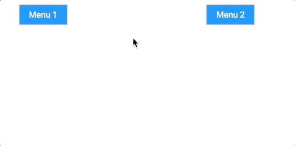

# \<tsante-dropdown\>

[](https://www.webcomponents.org/element/telecomsante/tsante-dropdown)

version : 0.1.0

A simple dropdown menu



## Quick example

<!--
```
<custom-element-demo>
  <template>
    <link rel="import" href="tsante-dropdown.html">
    <style>
        tsante-dropdown {
            font-family: Roboto, Arial, helvetica;
        }

        ul {
            margin: 0;
            padding: 0;
            list-style-type: none;
            width: 200px;
        }

        li {
            height: 35px;
            display: flex;
            align-items: center;
            padding: 0px 8px;
        }

        li:hover {
            background: dimgray;
            color: white;
        }

        button {
            border: 1px solid lightgray;
            padding: 5px 8px;
            outline: none;
            min-width:90px;
            margin: 0;
        }
    </style>
    <next-code-block></next-code-block>
  </template>
</custom-element-demo>
```
-->
```html
<tsante-dropdown horizontal-align='center' opened>
    <button>Trigger</button>
    <ul slot="dropdown-content">
        <li>Item 1</li>
        <li>Item 2</li>
        <li>Item 3</li>
        <li>Item 4</li>
    </ul>
</tsante-dropdown>
```

The component is licensed under the [ISC License](LICENSE.md)

## dev mode

```
npm install
npm start
```

the documentation should then be available on : 

http://0.0.0.0:8081/components/tsante-dropdown/
